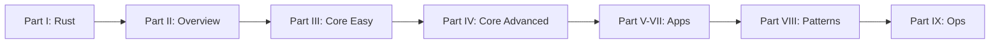

# Introduction

Welcome to **Whis Deep Dive**—a comprehensive guide to understanding the Whis codebase from the ground up.

## Who This Book Is For

This book is written for you if you:

- Are a senior software engineer who wants to deeply understand the Whis codebase
- Have experience with Rust and Vue but need refreshers on specific patterns
- Want to reason about the code from both bottom-up and top-down perspectives
- Prefer learning through progressive complexity: easy → advanced → expert

## How This Book Is Structured

The book follows a **spiral curriculum** approach, where concepts build incrementally:



### The Nine Parts

1. **Part I: Rust Refresher** - Pure Rust concepts isolated from Whis
2. **Part II: Overview** - What Whis does and how it's structured  
3. **Part III: Core Easy** - Simple modules (settings, clipboard, basic audio)
4. **Part IV: Core Advanced** - Complex patterns (providers, parallelism)
5. **Part V: CLI** - Command-line application
6. **Part VI: Tauri** - Desktop application
7. **Part VII: Vue** - Frontend integration
8. **Part VIII: Patterns** - Design decisions and alternatives
9. **Part IX: Operations** - Build system and CI/CD

> **Learning Philosophy**: Each chapter assumes you've read all previous chapters. No forward references to unexplained concepts.

## What You'll Learn

By the end of this book, you'll understand:

- **The Rust patterns** used throughout Whis (`Arc<Mutex<T>>`, trait objects, async/await)
- **The architecture** - why the codebase is structured this way
- **The data flow** - from microphone to clipboard
- **How to extend** - add providers, commands, and features
- **Alternative designs** - what else could have been done and why we chose this path

## Test Features

Let's verify our mdbook setup works correctly:

### Syntax Highlighting Test

```rust
fn main() {
    let message = "Testing Rust syntax highlighting!";
    println!("{}", message);
}
```

## How to Read This Book

> **Reading Strategy**:
> - **First pass**: Read sequentially from Part I to Part IX
> - **Reference**: Use appendices and sidebar navigation to jump to specific topics
> - **Exercises**: Try the hands-on exercises at the end of relevant chapters
> - **Code exploration**: Open the Whis repository alongside this book

## Prerequisites

This book assumes you have:

- Basic Rust knowledge (you've completed the Rust Book at some point)
- Familiarity with async/await concepts
- Some Vue.js experience (we cover Vue lightly)
- The Whis repository cloned locally

## Notation Used

Throughout this book:

- `code snippets` refer to Rust code, commands, or file paths
- **Bold** emphasizes important concepts
- File references look like: `crates/whis-core/src/audio.rs:122-141`
- Internal links: [Chapter 1: Ownership](./part1-rust-refresher/ch01-ownership.md)

---

Let's begin with [Part I: Rust Refresher](./part1-rust-refresher/README.md)!
