# Chapter 6: What Whis Does

Before diving into how Whis works internally, let's step back and understand *what* it does from a user's perspective. This chapter gives you the 30,000-foot view of the entire system's purpose and data flow.

## The User Experience

Here's what happens when you use Whis:

1. **Press a hotkey** (e.g., `Ctrl+Shift+Space`)
2. **Speak into your microphone** - Whis records your voice
3. **Press the hotkey again** to stop recording
4. **Wait a moment** - Whis transcribes your audio using AI
5. **Your text appears in the clipboard** - Paste it anywhere with `Ctrl+V`

That's it. No opening apps, no clicking buttons, no switching windows. Just press, speak, press, paste.

## The Data Flow

Under the hood, here's how your voice becomes text:

```mermaid
graph TB
    MIC[🎤 Microphone] --> SAMPLES[Raw Audio Samples<br/>f32 PCM data]
    SAMPLES --> WAV[WAV Buffer<br/>in memory]
    WAV --> ENCODER[MP3 Encoder<br/>FFmpeg or embedded]
    ENCODER --> MP3[MP3 File<br/>compressed audio]
    
    MP3 --> CHECK{File Size}
    CHECK -->|< 20MB| SINGLE[Single API Request]
    CHECK -->|> 20MB| CHUNK[Split into Chunks]
    
    CHUNK --> PAR1[Parallel Request 1]
    CHUNK --> PAR2[Parallel Request 2]
    CHUNK --> PAR3[Parallel Request 3]
    
    SINGLE --> TRANSCRIPT[Raw Transcription]
    PAR1 --> MERGE[Merge Transcriptions]
    PAR2 --> MERGE
    PAR3 --> MERGE
    MERGE --> TRANSCRIPT
    
    TRANSCRIPT --> POLISH{Polish Enabled?}
    POLISH -->|Yes| LLM[LLM Post-Processing<br/>fix grammar, punctuation]
    POLISH -->|No| CLIP[📋 Clipboard]
    LLM --> CLIP
    
    style MIC fill:#ff6b6b
    style MP3 fill:#4ecdc4
    style TRANSCRIPT fill:#ffe66d
    style CLIP fill:#50c878
```

Let's walk through each stage:

### 1. Audio Capture

Whis uses your system's microphone to capture audio as raw samples. These are 32-bit floating-point numbers (`f32`) representing sound waves at 16kHz sample rate (16,000 samples per second).

**Why this matters**: Raw audio is *huge*. One minute of 16kHz mono audio = ~1.92 MB of raw data. We need to compress it.

### 2. Encoding to MP3

The raw samples get encoded into MP3 format, which compresses the audio to about 10-20% of the original size. Whis supports two encoders:

- **FFmpeg** (desktop): Uses the system's FFmpeg installation
- **Embedded encoder** (mobile): Uses a Rust library (`lame-rs`) to avoid external dependencies

**Why this matters**: API providers like OpenAI accept MP3, not raw PCM. Also, network bandwidth costs money.

### 3. API Request (with Chunking)

The MP3 gets sent to a transcription API (OpenAI Whisper, Groq, Deepgram, etc.). But there's a catch: most APIs have file size limits (~25MB).

If your recording exceeds 20MB, Whis:
- Splits the audio into overlapping chunks
- Sends up to **3 chunks in parallel** (using `tokio::spawn` + `Semaphore`)
- Merges the transcriptions back together

**Why this matters**: This lets you record hour-long meetings without hitting API limits. The parallel processing also makes it faster.

> **Key Insight**: The 20MB threshold and max-3-concurrent-requests are hardcoded values that balance API limits, network bandwidth, and rate limiting.

### 4. Post-Processing (Optional)

If you enable "polishing," Whis sends the raw transcription to an LLM (GPT-4, Claude, local LLM) to:
- Fix grammar and punctuation
- Remove filler words ("um," "uh")
- Format the text nicely

This is optional because it costs extra API credits and adds latency.

### 5. Clipboard Integration

Finally, the transcribed (and optionally polished) text gets copied to your system clipboard. You can paste it into any application.

**Platform-specific notes**:
- **Linux**: Uses X11 clipboard via `arboard` crate
- **macOS**: Uses system clipboard APIs
- **Windows**: Uses Win32 clipboard APIs

## Why Whis Exists

Voice-to-text isn't new. So why build Whis?

### Problem 1: Friction

Most transcription tools require:
- Opening a web app or native app
- Clicking "Record"
- Saving the file
- Uploading the file
- Waiting for results
- Copying the text
- Switching back to your work

**Whis eliminates all of this.** It's a global hotkey away, always running in the background.

### Problem 2: Privacy

Cloud-based dictation (like Google Docs voice typing) sends your audio to servers continuously. You have no control over which provider handles your data.

**Whis gives you choice:**
- Use OpenAI, Groq, Deepgram, or Mistral
- Or use local Whisper models (no internet required)
- Explicitly choose when audio is recorded
- Audio is never stored on disk (stays in memory)

### Problem 3: Platform Lock-In

Apple's dictation only works well on macOS. Windows Speech Recognition only works on Windows. Google's tools require Chrome.

**Whis is cross-platform:**
- Linux (X11, Wayland)
- macOS
- Windows
- Android (via Tauri Mobile)
- iOS (experimental)

### Problem 4: Flexibility

Most transcription tools lock you into one provider. If OpenAI's API is down, you're stuck.

**Whis supports 6+ providers:**
- OpenAI (Whisper API)
- Groq (fastest inference)
- Deepgram (streaming transcription)
- Mistral
- ElevenLabs
- Local Whisper (via `whisper.cpp`)

You can switch providers in settings without changing your workflow.

## The Core Loop

Let's zoom out to the essential cycle:

At any given moment, Whis is in one of these states:
- **Idle**: Waiting for you to press the hotkey
- **Recording**: Capturing audio from your microphone
- **Transcribing**: Sending audio to API and waiting for text
- **Polishing**: (Optional) Sending transcription to LLM for cleanup
- **ClipboardReady**: Text is in clipboard, ready to paste

The entire system is built around making this loop as fast and frictionless as possible.

## Summary

**Key Takeaways:**

1. **User perspective**: Press hotkey → speak → press again → paste text
2. **Data flow**: Microphone → Samples → MP3 → API → Transcription → Clipboard
3. **Chunking strategy**: Files >20MB get split and transcribed in parallel (max 3 concurrent)
4. **Why Whis?** Low friction, privacy control, cross-platform, provider flexibility

**Where This Matters in Whis:**

- The entire architecture (Parts III-IV) serves this core user experience
- Every optimization decision trades off speed vs accuracy vs cost
- Platform-specific code (`whis-cli`, `whis-desktop`, `whis-mobile`) all implement this same flow

**What We Skipped:**

- *How* hotkeys are registered (covered in Chapter 11)
- *How* audio recording works (covered in Chapter 9)
- *How* providers are implemented (covered in Chapter 10)
- *How* error handling works (covered in Chapter 14)

Those details come later. For now, just remember: **Whis turns your voice into text as quickly and invisibly as possible.**

---

Next: [Chapter 7: Crate Architecture](./ch07-crate-architecture.md)
