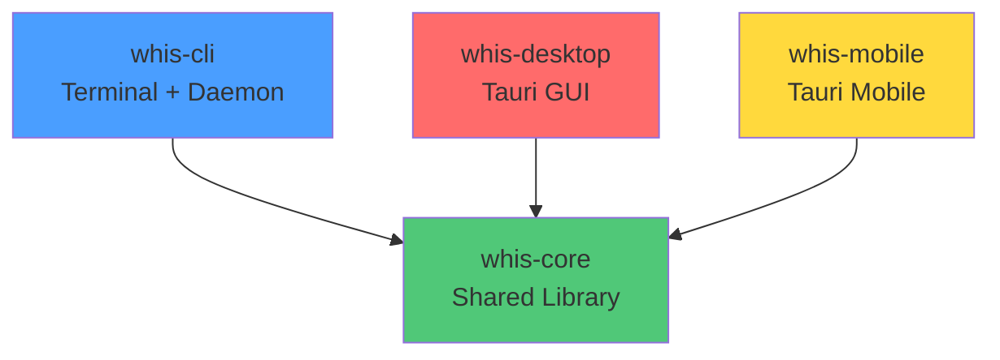
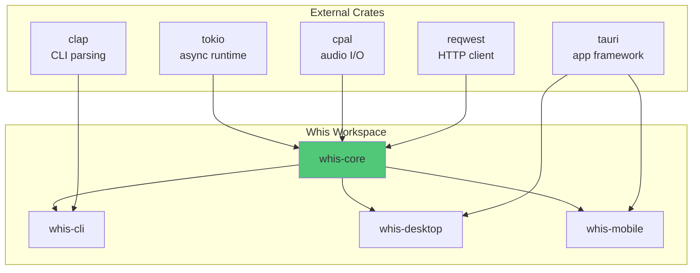

# Chapter 7: Crate Architecture

Whis isn't a single monolithic application. It's a **workspace** containing four separate crates that share common code while targeting different platforms. This chapter explains why the codebase is structured this way and how the crates relate to each other.

## The Four Crates



### 1. `whis-core` - The Engine

**Location**: `crates/whis-core/`

**Purpose**: Contains all the shared logic that every platform needs:
- Audio recording (`audio.rs`)
- MP3 encoding (`encoding.rs`)
- Provider implementations (OpenAI, Groq, etc.) (`provider/`)
- Transcription chunking and parallel processing (`transcribe.rs`)
- Settings management (`settings.rs`)
- Clipboard integration (`clipboard.rs`)

**Key point**: This is a **library crate** (`lib.rs`). It doesn't have a `main()` function. It only exports modules that other crates can use.

**Dependencies** (from `Cargo.toml`):
```toml
[dependencies]
tokio = { version = "1", features = ["full"] }
anyhow = "1.0"
serde = { version = "1.0", features = ["derive"] }
reqwest = { version = "0.11", features = ["json", "multipart"] }
cpal = "0.15"  # Cross-platform audio
# ... and many more
```

> **Key Insight**: By putting shared code in `whis-core`, we avoid duplicating logic across CLI, desktop, and mobile. Any bug fix or feature in `whis-core` automatically benefits all platforms.

### 2. `whis-cli` - Terminal Interface

**Location**: `crates/whis-cli/`

**Purpose**: Provides a command-line interface for Whis. This is the original way to use Whis before the GUI existed.

**Features**:
- `whis transcribe <file>` - Transcribe an audio file
- `whis record` - Start recording (CLI version)
- `whis daemon` - Run as background service with hotkey support
- `whis config` - Manage settings via terminal

**Why this exists**: 
- Some users prefer terminal workflows
- Servers and headless systems don't have GUIs
- Easier to script and automate
- Lower resource usage than GUI

**Key file**: `crates/whis-cli/src/main.rs` - Entry point with `clap` argument parsing

**Platform support**: Linux, macOS, Windows (but hotkeys only work on X11/macOS for now)

### 3. `whis-desktop` - Tauri GUI

**Location**: `crates/whis-desktop/`

**Purpose**: Desktop GUI application built with Tauri (Rust backend + web frontend).

**Features**:
- System tray icon (sits in menu bar/taskbar)
- Settings panel with visual controls
- Provider selection dropdown
- Hotkey configuration
- Real-time recording status
- Cross-platform desktop support

**Tech stack**:
- **Backend**: Rust + Tauri (`src/main.rs`, `src/lib.rs`)
- **Frontend**: Svelte (lives in `ui/`)
- **IPC**: Tauri commands (`src/commands.rs`)

**Why Tauri?**
- Smaller binaries than Electron (~10MB vs ~100MB)
- Native performance (Rust backend)
- Web tech for UI (easy to prototype)
- Cross-platform out of the box

**Builds to**:
- `.deb` (Debian/Ubuntu)
- `.AppImage` (universal Linux)
- `.dmg` (macOS)
- `.exe` (Windows installer)

### 4. `whis-mobile` - Tauri Mobile

**Location**: `crates/whis-mobile/`

**Purpose**: Mobile apps for Android and iOS using Tauri's mobile support.

**Key differences from desktop**:
- Uses **embedded MP3 encoder** (no FFmpeg dependency)
- Different permission model (mic access requires prompts)
- Touch-based UI instead of hotkeys
- Smaller binary size constraints

**Feature flag differences**:
```toml
[dependencies.whis-core]
default-features = false
features = ["embedded-encoder"]  # NOT "ffmpeg"
```

**Build targets**:
- Android: `target/aarch64-linux-android/`
- iOS: `target/aarch64-apple-ios/` (experimental)

**Why separate from desktop?** Mobile has fundamentally different:
- UI paradigms (no system tray)
- Permission systems
- Build toolchains (Android SDK, Xcode)
- Distribution channels (Google Play, App Store)

## Dependency Graph

Here's the full picture of how code flows through the workspace:



**Reading this diagram**:
- `whis-core` depends on low-level crates (`tokio`, `cpal`, `reqwest`)
- All three apps depend on `whis-core`
- `whis-cli` adds CLI-specific dependencies (`clap`)
- `whis-desktop` and `whis-mobile` add Tauri

## Workspace Configuration

The root `Cargo.toml` defines the workspace:

```toml
[workspace]
members = [
    "crates/whis-core",
    "crates/whis-cli",
    "crates/whis-desktop",
    "crates/whis-mobile",
]
resolver = "2"

[workspace.package]
version = "0.5.7"
edition = "2021"
license = "MIT"
```

**Benefits of workspaces**:
1. **Shared dependencies**: All crates use the same version of `tokio`, `anyhow`, etc.
2. **Single `Cargo.lock`**: Ensures reproducible builds across all crates
3. **Unified builds**: `cargo build --workspace` builds everything
4. **Cross-crate references**: Each crate can depend on `whis-core` via path

## How Crates Import Each Other

In `whis-cli/Cargo.toml`:
```toml
[dependencies]
whis-core = { path = "../whis-core" }
```

In `whis-cli/src/main.rs`:
```rust
use whis_core::transcribe::transcribe_audio;
use whis_core::settings::Settings;
use whis_core::provider::ProviderRegistry;
```

This imports code directly from `whis-core` as if it were any other Rust library.

## Why This Architecture?

You might wonder: why not just put everything in one crate?

### Reason 1: Code Reuse

Without `whis-core`, we'd have three copies of the audio recording logic, one in each app. That means:
- 3× the code to maintain
- 3× the potential for bugs
- 3× the work to add new providers

With `whis-core`, we write it once and share it everywhere.

### Reason 2: Compilation Speed

When you change `whis-desktop/ui/src/App.svelte` (the frontend), you don't need to recompile `whis-core`. Cargo only rebuilds `whis-desktop`.

If everything was in one crate, every change would trigger a full rebuild.

### Reason 3: Separation of Concerns

Each crate has a clear responsibility:
- `whis-core`: Business logic (recording, transcription)
- `whis-cli`: Terminal interface
- `whis-desktop`: Desktop GUI
- `whis-mobile`: Mobile GUI

This makes the codebase easier to navigate and reason about.

### Reason 4: Feature Flags Per Platform

Mobile needs `embedded-encoder`. Desktop needs `ffmpeg`. CLI might need neither.

With separate crates, each can enable exactly the features it needs:

**Desktop**:
```toml
whis-core = { path = "../whis-core", features = ["ffmpeg", "clipboard"] }
```

**Mobile**:
```toml
whis-core = { path = "../whis-core", features = ["embedded-encoder"] }
```

This keeps binary sizes down and compile times fast.

## Build Targets

Here's what you get when you build each crate:

| Crate | Binary Name | Size (release) | Platforms |
|-------|-------------|----------------|-----------|
| `whis-cli` | `whis` | ~8 MB | Linux, macOS, Windows |
| `whis-desktop` | `whis-desktop` | ~12 MB | Linux, macOS, Windows |
| `whis-mobile` | `whis-mobile` | ~15 MB | Android, iOS |

> **Note**: Sizes are approximate and vary by platform and enabled features.

## Summary

**Key Takeaways:**

1. **Four crates**: `whis-core` (library), `whis-cli` (terminal), `whis-desktop` (Tauri GUI), `whis-mobile` (Tauri mobile)
2. **Dependency flow**: All apps depend on `whis-core`, which depends on low-level crates
3. **Why this structure?** Code reuse, faster compilation, separation of concerns, feature flag flexibility
4. **Workspace benefits**: Shared versions, single lock file, unified builds

**Where This Matters in Whis:**

- When adding a feature, you decide: does it go in `whis-core` (shared) or a specific app?
- When fixing a bug in audio recording, you edit `whis-core` and all apps benefit
- When building for mobile, you use different feature flags than desktop

**What's Next:**

Now that you understand the crate structure, Chapter 8 explores **feature flags** in depth. You'll learn how `#[cfg(feature = "...")]` lets us compile different code for different platforms without duplicating files.

---

Next: [Chapter 8: Feature Flags and Conditional Compilation](./ch08-feature-flags.md)
