# Chapter 11: Audio Recording - The Basics

Recording audio is the heart of Whis. This chapter introduces the `cpal` crate (Cross-Platform Audio Library) and shows how Whis captures microphone input as raw PCM samples. We'll cover device selection, stream configuration, sample formats, and the data callback pattern.

## What is `cpal`?

[`cpal`](https://github.com/RustAudio/cpal) is Rust's de facto standard for cross-platform audio I/O. It provides a unified API over:

- **Linux**: ALSA, PulseAudio, JACK, or PipeWire
- **macOS**: CoreAudio
- **Windows**: WASAPI
- **Android**: Oboe
- **iOS**: CoreAudio

**Why `cpal`?** It's the only Rust audio library that:
1. Works on all platforms Whis supports
2. Provides low-level access to audio streams
3. Has active maintenance and community support

## Audio Concepts Primer

Before diving into code, let's define key terms:

### Sample

A **sample** is a single number representing audio amplitude at one instant in time. 

**Common formats**:
- `f32`: Floating-point, range [-1.0, 1.0]
- `i16`: 16-bit integer, range [-32768, 32767]
- `u16`: Unsigned 16-bit, range [0, 65535]

Whis internally uses `f32` for all processing.

### Sample Rate

**Sample rate** is how many samples per second. Common rates:
- 44100 Hz (CD quality)
- 48000 Hz (professional audio)
- 16000 Hz (speech, Whisper's preferred rate)

**Example**: At 44100 Hz, one second of audio = 44,100 samples.

### Channels

**Channels** represent independent audio streams:
- **Mono (1)**: Single microphone
- **Stereo (2)**: Left + right microphones

Whis uses **mono** because speech transcription doesn't need stereo.

### Stream

A **stream** is a continuous flow of audio data from a device. Once started, the OS calls your callback function whenever new samples arrive (typically every 10-20ms).

## Basic `cpal` Usage

Here's the minimal pattern for recording audio:

```rust
use cpal::traits::{HostTrait, DeviceTrait, StreamTrait};

fn record_audio() -> Result<()> {
    // 1. Get the default audio host (OS-specific)
    let host = cpal::default_host();
    
    // 2. Get the default input device (microphone)
    let device = host.default_input_device()
        .ok_or("No input device found")?;
    
    // 3. Get the device's default config
    let config = device.default_input_config()?;
    
    // 4. Build a stream with a data callback
    let stream = device.build_input_stream(
        &config.into(),
        |data: &[f32], _info| {
            // This closure runs every ~10-20ms with new samples
            println!("Received {} samples", data.len());
        },
        |err| eprintln!("Stream error: {err}"),
        None, // timeout
    )?;
    
    // 5. Start the stream (activates microphone)
    stream.play()?;
    
    // 6. Keep stream alive (dropping it stops recording)
    std::thread::sleep(std::time::Duration::from_secs(5));
    
    Ok(())
}
```

**Key points**:
1. `cpal::default_host()` selects the OS-appropriate backend
2. `default_input_device()` finds the system default mic
3. `build_input_stream()` takes two closures: data callback + error callback
4. **Stream must stay alive** - dropping it stops recording
5. Callback runs on a separate audio thread

## How Whis Uses `cpal`

Let's trace through `AudioRecorder::new()` and `start_recording()`:

### Structure Definition

```rust
pub struct AudioRecorder {
    samples: Arc<Mutex<Vec<f32>>>,
    sample_rate: u32,
    channels: u16,
    stream: Option<cpal::Stream>,
}
```

**From `whis-core/src/audio.rs:39-44`**

**Fields**:
- **`samples`**: Shared buffer for accumulating audio data
  - `Arc<Mutex<...>>` because the audio callback runs on a different thread
  - Remember from Chapter 2: `Arc` = shared ownership, `Mutex` = thread-safe mutation
- **`sample_rate`**: Detected from device (e.g., 44100)
- **`channels`**: Number of channels (typically 1 for mono)
- **`stream`**: The active recording stream (kept alive while recording)

### Creating the Recorder

```rust
pub fn new() -> Result<Self> {
    Ok(AudioRecorder {
        samples: Arc::new(Mutex::new(Vec::new())),
        sample_rate: 44100, // Placeholder (overwritten on start)
        channels: 1,        // Placeholder
        stream: None,       // No stream yet
    })
}
```

**From `whis-core/src/audio.rs:47-54`**

This just allocates the struct. No device access yet.

### Starting Recording

```rust
pub fn start_recording(&mut self) -> Result<()> {
    let host = cpal::default_host();
    let device = host
        .default_input_device()
        .context("No input device available")?;

    let config = device
        .default_input_config()
        .context("Failed to get default input config")?;

    self.sample_rate = config.sample_rate().0;
    self.channels = config.channels();

    let samples = self.samples.clone(); // Arc clone for callback
    samples.lock().unwrap().clear();    // Clear previous recording

    let stream = match config.sample_format() {
        cpal::SampleFormat::F32 => {
            self.build_stream::<f32>(&device, &config.into(), samples)?
        }
        cpal::SampleFormat::I16 => {
            self.build_stream::<i16>(&device, &config.into(), samples)?
        }
        cpal::SampleFormat::U16 => {
            self.build_stream::<u16>(&device, &config.into(), samples)?
        }
        _ => anyhow::bail!("Unsupported sample format"),
    };

    stream.play()?;
    self.stream = Some(stream); // Keep stream alive

    Ok(())
}
```

**From `whis-core/src/audio.rs:56-91`**

**Step-by-step**:

1. **Get host and device**: `cpal::default_host()` + `default_input_device()`
2. **Get config**: `default_input_config()` returns `SupportedStreamConfig`
   - Contains sample rate, channels, sample format
3. **Store config**: Save `sample_rate` and `channels` for later use
4. **Clone Arc**: `self.samples.clone()` creates a new reference (not a copy!)
5. **Clear buffer**: Empty previous samples
6. **Match on sample format**: Different devices use different formats
   - Call `build_stream::<T>()` with appropriate type parameter
7. **Start stream**: `stream.play()` activates the microphone
8. **Store stream**: Assign to `self.stream` to keep it alive

> **Key Insight**: The `match config.sample_format()` is necessary because cpal supports different native formats. We convert everything to `f32` internally using generic conversion.

## Building the Stream (Generic)

The `build_stream()` method handles any sample format using generics:

```rust
fn build_stream<T>(
    &self,
    device: &cpal::Device,
    config: &cpal::StreamConfig,
    samples: Arc<Mutex<Vec<f32>>>,
) -> Result<cpal::Stream>
where
    T: cpal::Sample + cpal::SizedSample,
    f32: cpal::FromSample<T>,
{
    let err_fn = |err| eprintln!("Error in audio stream: {err}");

    let stream = device.build_input_stream(
        config,
        move |data: &[T], _: &cpal::InputCallbackInfo| {
            let mut samples = samples.lock().unwrap();
            for &sample in data {
                samples.push(cpal::Sample::from_sample(sample));
            }
        },
        err_fn,
        None, // timeout
    )?;

    Ok(stream)
}
```

**From `whis-core/src/audio.rs:93-118`**

**Generic bounds explained**:

- **`T: cpal::Sample`**: `T` is a valid audio sample type
- **`T: cpal::SizedSample`**: `T` has a known size (not dynamically sized)
- **`f32: cpal::FromSample<T>`**: We can convert `T` → `f32`

**The data callback** (`move |data: &[T], _| {...}`):

1. **Lock the mutex**: `samples.lock().unwrap()`
   - This blocks briefly while we append samples
2. **Convert and append**: `cpal::Sample::from_sample(sample)` converts `T` → `f32`
3. **Unlock implicitly**: Lock guard drops at end of scope

**Why `move` closure?**  
Because we transfer ownership of the `Arc<Mutex<...>>` clone into the callback. The callback outlives this function call.

## Sample Format Conversion

Different audio devices return different sample types. `cpal` handles conversion:

**i16 → f32**:
```rust
let i16_sample: i16 = 16000;
let f32_sample: f32 = cpal::Sample::from_sample(i16_sample);
// f32_sample ≈ 0.488 (normalized to [-1.0, 1.0])
```

**u16 → f32**:
```rust
let u16_sample: u16 = 48000;
let f32_sample: f32 = cpal::Sample::from_sample(u16_sample);
// f32_sample ≈ 0.465 (normalized to [-1.0, 1.0])
```

Whis doesn't care about the original format—everything becomes `f32` internally.

## Thread Safety and Lifetimes

The audio callback runs on a **separate thread** managed by the OS audio driver. This creates several constraints:

### Constraint 1: Data Must Be `Send + Sync`

The closure moves `Arc<Mutex<Vec<f32>>>` across threads. This requires:
- `Arc`: Implements `Send + Sync` ✓
- `Mutex`: Implements `Send + Sync` ✓
- `Vec<f32>`: `f32` implements `Send + Sync` ✓

Everything checks out.

### Constraint 2: No Blocking Operations

The callback should return quickly (<1ms). Long operations cause audio glitches.

**Good**:
```rust
move |data: &[f32], _| {
    let mut buf = samples.lock().unwrap();
    buf.extend_from_slice(data); // Fast
}
```

**Bad**:
```rust
move |data: &[f32], _| {
    let mut buf = samples.lock().unwrap();
    transcode_to_mp3(buf); // SLOW - causes audio dropout
}
```

Whis only appends to a `Vec` in the callback, which is fast (amortized O(1)).

### Constraint 3: Stream Lifetime

The stream **must** stay alive during recording. When dropped, the callback stops.

**Wrong**:
```rust
pub fn start_recording(&mut self) -> Result<()> {
    let stream = /* build stream */;
    stream.play()?;
    // Stream drops here - recording stops immediately!
    Ok(())
}
```

**Correct** (Whis approach):
```rust
pub fn start_recording(&mut self) -> Result<()> {
    let stream = /* build stream */;
    stream.play()?;
    self.stream = Some(stream); // Keep alive
    Ok(())
}
```

The stream lives as long as `AudioRecorder` exists.

## Error Handling in the Callback

The `err_fn` closure handles stream errors:

```rust
let err_fn = |err| eprintln!("Error in audio stream: {err}");
```

**Common errors**:
- **Device disconnected**: User unplugs USB microphone
- **Buffer overflow**: OS can't deliver samples fast enough
- **Driver crash**: Rare, but possible

Currently, Whis just logs errors. A production implementation might:
- Notify the user ("Microphone disconnected")
- Automatically stop recording
- Try to restart the stream

## Querying Device Information

Before starting recording, you can query device capabilities:

```rust
let device = host.default_input_device()?;

// Get device name
println!("Using device: {}", device.name()?);

// Get supported configs
let configs = device.supported_input_configs()?;
for config in configs {
    println!("  Sample rate: {} - {}", 
        config.min_sample_rate().0, 
        config.max_sample_rate().0
    );
    println!("  Channels: {}", config.channels());
    println!("  Format: {:?}", config.sample_format());
}
```

This is useful for letting users select a specific microphone or sample rate in the GUI.

## The Data Flow

Let's visualize how samples flow from the microphone to the buffer:

```mermaid
graph LR
    MIC[🎤 Microphone] --> DRIVER[Audio Driver]
    DRIVER --> |"OS delivers samples<br/>(every 10-20ms)"| CALLBACK[cpal Callback]
    CALLBACK --> |"Lock mutex"| MUTEX[Mutex&lt;Vec&lt;f32&gt;&gt;]
    MUTEX --> |"Append samples"| BUFFER[Sample Buffer]
    
    MAIN[Main Thread] -.->|"Read on stop"| BUFFER
    
    style MIC fill:#ff6b6b
    style CALLBACK fill:#4ecdc4
    style BUFFER fill:#ffe66d
```



**Key points**:
1. Audio driver calls callback **on its own thread**
2. Callback locks the mutex briefly to append samples
3. Main thread reads the buffer **only after stopping** the stream

## Sample Rate Considerations

Whis detects the device's native sample rate but doesn't resample:

```rust
self.sample_rate = config.sample_rate().0; // e.g., 44100
```

**Typical rates**:
- Laptop built-in mic: 44100 Hz
- USB mic: 48000 Hz
- Phone mic: 16000 or 48000 Hz

**Whisper prefers 16kHz**, but Whis doesn't downsample at capture time. Instead:
1. Record at native rate (44100 Hz)
2. Later, use `rubato` crate to resample to 16kHz before sending to API

Why? Downsampling in the callback would slow it down and risk glitches.

## Summary

**Key Takeaways:**

1. **`cpal` crate**: Cross-platform audio abstraction over OS APIs
2. **Stream lifecycle**: Create → Build → Play → Keep alive → Drop to stop
3. **Data callback**: Runs on separate thread, must be fast
4. **Sample formats**: Convert everything to `f32` internally
5. **Thread safety**: `Arc<Mutex<Vec<f32>>>` allows safe sharing

**Where This Matters in Whis:**

- CLI records audio when user presses hotkey (`whis-cli/src/commands/listen.rs`)
- Desktop GUI shows recording status while stream is active (`whis-desktop/src/commands.rs`)
- Mobile uses same `AudioRecorder` struct (`whis-mobile/src/commands.rs`)

**Patterns Used:**

- **Arc for shared ownership**: Callback and main thread share sample buffer
- **Mutex for interior mutability**: Append samples from callback thread
- **Generic conversion**: `build_stream::<T>()` handles any sample format
- **RAII lifetime management**: Stream stops when dropped

**What's Next:**

Chapter 12 explores the **recording lifecycle**: how Whis transitions between Idle → Recording → Processing states, stops the stream safely, and converts raw samples to MP3.

---

Next: [Chapter 12: Audio Recording - Lifecycle](./ch12-audio-lifecycle.md)
