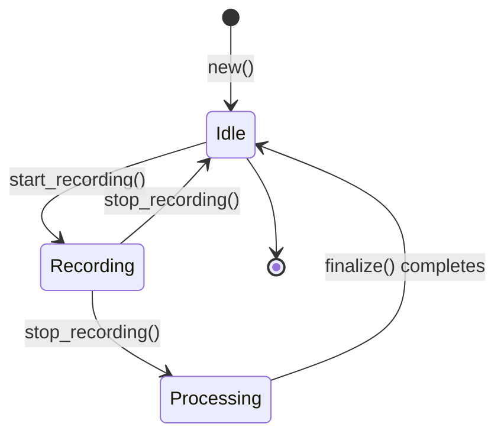

# Chapter 12: Audio Recording - Lifecycle

Chapter 11 showed how to *start* recording. This chapter explores the complete lifecycle: stopping the stream, extracting samples, converting to MP3, and handling large recordings through chunking. You'll see why Whis separates `AudioRecorder` from `RecordingData` and how this design enables async/await integration.

## The State Machine

At any moment, `AudioRecorder` is in one of three conceptual states:



**State descriptions**:

1. **Idle**: No stream, no recording in progress
2. **Recording**: Active stream, samples accumulating in buffer
3. **Processing**: Stream stopped, converting samples to MP3

Let's trace through stopping and finalizing a recording.

## Stopping the Stream

When the user stops recording (presses hotkey again), Whis calls `stop_recording()`:

```rust
pub fn stop_recording(&mut self) -> Result<RecordingData> {
    // Drop the stream first to release the microphone
    self.stream = None;

    // Take ownership of samples and clear the buffer
    let samples: Vec<f32> = {
        let mut guard = self.samples.lock().unwrap();
        std::mem::take(&mut *guard)
    };

    if samples.is_empty() {
        anyhow::bail!("No audio data recorded");
    }

    Ok(RecordingData {
        samples,
        sample_rate: self.sample_rate,
        channels: self.channels,
    })
}
```

**From `whis-core/src/audio.rs:122-141`**

**Step-by-step**:

### 1. Drop the Stream

```rust
self.stream = None;
```

Setting `stream` to `None` **drops the `cpal::Stream`**, which:
- Stops the audio callback immediately
- Releases the microphone
- Closes the audio device

> **Key Insight**: RAII (Resource Acquisition Is Initialization) at work. We don't call `stream.stop()` explicitly—dropping the stream automatically stops recording.

### 2. Extract Samples with `std::mem::take()`

```rust
let samples: Vec<f32> = {
    let mut guard = self.samples.lock().unwrap();
    std::mem::take(&mut *guard)
};
```

**What `std::mem::take()` does** (from Chapter 1):
- Replaces the value with `Default::default()` (empty `Vec`)
- Returns ownership of the original value
- Avoids cloning the entire buffer

**Without `take()`** (inefficient):
```rust
let samples = guard.clone(); // Copies all samples!
guard.clear();
```

**With `take()`** (efficient):
```rust
let samples = std::mem::take(&mut *guard); // Moves samples, leaves empty Vec
```

This is **O(1)** instead of **O(n)**.

### 3. Validate Data

```rust
if samples.is_empty() {
    anyhow::bail!("No audio data recorded");
}
```

If the user presses stop immediately after start, there might be no samples. Better to fail early with a clear error.

### 4. Return `RecordingData`

```rust
Ok(RecordingData {
    samples,
    sample_rate: self.sample_rate,
    channels: self.channels,
})
```

**Why a separate struct?**  
Because `AudioRecorder` contains `stream: Option<cpal::Stream>`, and **on macOS, `cpal::Stream` is not `Send`**. This means you can't move `AudioRecorder` across threads or use it in async contexts easily.

`RecordingData` is just plain data—no streams, no OS handles—so it's trivially `Send + Sync`.

## The `RecordingData` Struct

```rust
pub struct RecordingData {
    samples: Vec<f32>,
    sample_rate: u32,
    channels: u16,
}
```

**From `whis-core/src/audio.rs:33-37`**

This struct exists solely to enable:
```rust
let data = recorder.stop_recording()?;

// Move data to blocking thread for MP3 encoding
tokio::task::spawn_blocking(move || {
    data.finalize() // Expensive CPU work here
}).await?;
```

If we tried to move `AudioRecorder` instead, we'd get:
```
error[E0277]: `cpal::Stream` cannot be sent between threads safely
```

## Converting Samples to MP3

The `finalize()` method does the heavy lifting:

```rust
pub fn finalize(self) -> Result<RecordingOutput> {
    // Try to convert the entire recording first
    let mp3_data = self.samples_to_mp3(&self.samples, "main")?;

    // If at or under threshold, return as single file (fast path)
    if mp3_data.len() <= CHUNK_THRESHOLD_BYTES {
        return Ok(RecordingOutput::Single(mp3_data));
    }

    // File is too large - need to chunk it
    let samples_per_second = self.sample_rate as usize * self.channels as usize;
    let chunk_samples = CHUNK_DURATION_SECS * samples_per_second;
    let overlap_samples = CHUNK_OVERLAP_SECS * samples_per_second;

    let mut chunks = Vec::new();
    let mut chunk_start = 0usize;
    let mut chunk_index = 0usize;

    while chunk_start < self.samples.len() {
        let chunk_end = (chunk_start + chunk_samples).min(self.samples.len());
        let chunk_slice = &self.samples[chunk_start..chunk_end];

        // Convert this chunk to MP3
        let chunk_mp3 = self.samples_to_mp3(chunk_slice, &format!("chunk{chunk_index}"))?;

        chunks.push(AudioChunk {
            data: chunk_mp3,
            index: chunk_index,
            has_leading_overlap: chunk_index > 0,
        });

        chunk_index += 1;

        if chunk_end >= self.samples.len() {
            break;
        }

        // Move to next chunk, stepping back by overlap amount
        chunk_start = chunk_end.saturating_sub(overlap_samples);
    }

    Ok(RecordingOutput::Chunked(chunks))
}
```

**From `whis-core/src/audio.rs:152-195`**

### Two Paths: Single vs Chunked

```rust
const CHUNK_THRESHOLD_BYTES: usize = 20 * 1024 * 1024; // 20 MB
```

**From `whis-core/src/audio.rs:6`**

**Fast path (< 20 MB)**:
```rust
if mp3_data.len() <= CHUNK_THRESHOLD_BYTES {
    return Ok(RecordingOutput::Single(mp3_data));
}
```

Most recordings are short (< 5 minutes). Just return the whole MP3.

**Chunked path (≥ 20 MB)**:
- Split recording into 5-minute chunks with 2-second overlap
- Convert each chunk to MP3 separately
- Return as `RecordingOutput::Chunked(Vec<AudioChunk>)`

### Chunking Strategy

**Constants**:
```rust
const CHUNK_DURATION_SECS: usize = 300; // 5 minutes
const CHUNK_OVERLAP_SECS: usize = 2;    // 2 seconds overlap
```

**From `whis-core/src/audio.rs:8-10`**

**Why 5 minutes?**  
At 44100 Hz mono, 5 minutes = 13,230,000 samples × 4 bytes = ~50 MB uncompressed, but ~5-10 MB as MP3 (well under the 20 MB threshold per chunk).

**Why 2-second overlap?**  
To avoid cutting words in half at chunk boundaries. The transcription API sees the last 2 seconds of chunk N and the first 2 seconds of chunk N+1, preventing missing words.

**Chunking loop visualization**:

```
Recording: [------------------------------------------------] 20 minutes

Chunk 0:   [============================]         (0:00 - 5:00)
Chunk 1:              [============================]   (4:58 - 9:58)
Chunk 2:                         [============================] (9:56 - 14:56)
                                            ^
                                     2-sec overlap
```

**Code walkthrough**:

```rust
let samples_per_second = self.sample_rate as usize * self.channels as usize;
// At 44100 Hz mono: 44100 samples/sec

let chunk_samples = CHUNK_DURATION_SECS * samples_per_second;
// 300 sec × 44100 = 13,230,000 samples per chunk

let overlap_samples = CHUNK_OVERLAP_SECS * samples_per_second;
// 2 sec × 44100 = 88,200 samples overlap
```

**Iteration**:

```rust
while chunk_start < self.samples.len() {
    let chunk_end = (chunk_start + chunk_samples).min(self.samples.len());
    let chunk_slice = &self.samples[chunk_start..chunk_end];
    
    // Convert to MP3...
    
    // Step back by overlap for next chunk
    chunk_start = chunk_end.saturating_sub(overlap_samples);
}
```

`saturating_sub()` prevents underflow on the last chunk.

## MP3 Encoding: FFmpeg Path

The `samples_to_mp3_ffmpeg()` method uses the system's FFmpeg:

```rust
#[cfg(feature = "ffmpeg")]
fn samples_to_mp3_ffmpeg(&self, samples: &[f32], suffix: &str) -> Result<Vec<u8>> {
    // 1. Convert f32 [-1.0, 1.0] to i16 [-32768, 32767]
    let i16_samples: Vec<i16> = samples
        .iter()
        .map(|&s| {
            let clamped = s.clamp(-1.0, 1.0);
            (clamped * i16::MAX as f32) as i16
        })
        .collect();

    // 2. Create unique temp file names
    let temp_dir = std::env::temp_dir();
    let unique_id = format!(
        "{}_{}_{suffix}",
        std::process::id(),
        std::time::SystemTime::now()
            .duration_since(std::time::UNIX_EPOCH)
            .unwrap()
            .as_nanos(),
    );
    let wav_path = temp_dir.join(format!("whis_{unique_id}.wav"));
    let mp3_path = temp_dir.join(format!("whis_{unique_id}.mp3"));

    // 3. Write WAV file using `hound` crate
    {
        let spec = hound::WavSpec {
            channels: self.channels,
            sample_rate: self.sample_rate,
            bits_per_sample: 16,
            sample_format: hound::SampleFormat::Int,
        };

        let mut writer = hound::WavWriter::create(&wav_path, spec)?;
        for sample in i16_samples {
            writer.write_sample(sample)?;
        }
        writer.finalize()?;
    }

    // 4. Call FFmpeg to convert WAV → MP3
    let output = std::process::Command::new("ffmpeg")
        .args([
            "-hide_banner",
            "-loglevel", "error",
            "-i", wav_path.to_str().unwrap(),
            "-codec:a", "libmp3lame",
            "-b:a", "128k",
            "-y",
            mp3_path.to_str().unwrap(),
        ])
        .output()
        .context("Failed to execute ffmpeg. Make sure ffmpeg is installed.")?;

    // 5. Clean up temp WAV
    let _ = std::fs::remove_file(&wav_path);

    if !output.status.success() {
        let _ = std::fs::remove_file(&mp3_path);
        let stderr = String::from_utf8_lossy(&output.stderr);
        anyhow::bail!("FFmpeg conversion failed: {stderr}");
    }

    // 6. Read MP3 data
    let mp3_data = std::fs::read(&mp3_path)
        .context("Failed to read converted MP3 file")?;

    // 7. Clean up temp MP3
    let _ = std::fs::remove_file(&mp3_path);

    Ok(mp3_data)
}
```

**From `whis-core/src/audio.rs:217-289`**

**Why this multi-step process?**

1. **`cpal` gives us f32 samples** - FFmpeg expects i16 WAV
2. **FFmpeg expects files** - Can't pipe raw PCM easily
3. **Temp files avoid conflicts** - Multiple concurrent encodings possible

**Unique file naming**:
```rust
let unique_id = format!("{}_{}_{suffix}", pid, timestamp_nanos);
```

This allows parallel MP3 encoding of different chunks without collisions.

### FFmpeg Arguments Explained

```bash
ffmpeg \
  -hide_banner \              # Don't show version info
  -loglevel error \           # Only show errors
  -i input.wav \              # Input WAV file
  -codec:a libmp3lame \       # Use LAME MP3 encoder
  -b:a 128k \                 # Bitrate: 128 kbps (good for speech)
  -y \                        # Overwrite output file
  output.mp3                  # Output MP3 file
```

**Why 128 kbps?**  
Speech doesn't need high bitrates. 128 kbps is transparent for voice and keeps file sizes reasonable (~1 MB per minute).

## MP3 Encoding: Embedded Path

For mobile (no FFmpeg), Whis uses the `mp3lame-encoder` crate:

```rust
#[cfg(feature = "embedded-encoder")]
fn samples_to_mp3_embedded(&self, samples: &[f32]) -> Result<Vec<u8>> {
    use mp3lame_encoder::{Builder, FlushNoGap, InterleavedPcm, MonoPcm};

    let mut mp3_encoder = Builder::new()
        .ok_or_else(|| anyhow::anyhow!("Failed to create MP3 encoder"))?;

    mp3_encoder.set_sample_rate(self.sample_rate)?;
    mp3_encoder.set_channels(self.channels)?;
    mp3_encoder.set_quality(mp3lame_encoder::Quality::Best)?;
    mp3_encoder.set_bitrate(mp3lame_encoder::Bitrate::Kbps128)?;

    let pcm = if self.channels == 1 {
        MonoPcm(samples)
    } else {
        InterleavedPcm(samples)
    };

    let mut mp3_data = mp3_encoder.encode(pcm)?;
    mp3_data.extend(mp3_encoder.flush::<FlushNoGap>()?);

    Ok(mp3_data)
}
```

**From `whis-core/src/audio.rs:294-320` (approximated)**

**Key differences from FFmpeg path**:
- No temp files - direct in-memory encoding
- Faster (no process spawn overhead)
- Larger binary (+2 MB for LAME encoder)

## The `RecordingOutput` Enum

After finalization, you get one of two variants:

```rust
pub enum RecordingOutput {
    Single(Vec<u8>),           // Small file, < 20 MB
    Chunked(Vec<AudioChunk>),  // Large file, split up
}
```

**From `whis-core/src/audio.rs:24-29`**

**`AudioChunk` struct**:

```rust
pub struct AudioChunk {
    pub data: Vec<u8>,                // MP3 bytes
    pub index: usize,                 // Chunk number (for ordering)
    pub has_leading_overlap: bool,    // True for chunks after first
}
```

**From `whis-core/src/audio.rs:13-21`**

**Usage in transcription** (simplified):

```rust
match recording_output {
    RecordingOutput::Single(mp3_data) => {
        // Send entire file to API
        let transcript = provider.transcribe(&mp3_data).await?;
        Ok(transcript)
    }
    RecordingOutput::Chunked(chunks) => {
        // Transcribe chunks in parallel
        let transcripts = transcribe_chunks_parallel(chunks).await?;
        Ok(merge_transcripts(transcripts))
    }
}
```

Parallel transcription is covered in detail in Chapter 15.

## Real-World Usage: Desktop GUI

Here's how the Tauri desktop app uses the recording lifecycle:

```rust
#[tauri::command]
pub async fn start_recording(state: State<'_, AppState>) -> Result<(), String> {
    let mut recorder = state.recorder.lock().await;
    recorder.start_recording().map_err(|e| e.to_string())?;
    Ok(())
}

#[tauri::command]
pub async fn stop_and_transcribe(
    state: State<'_, AppState>
) -> Result<String, String> {
    // 1. Stop recording (on main thread, fast)
    let recording_data = {
        let mut recorder = state.recorder.lock().await;
        recorder.stop_recording().map_err(|e| e.to_string())?
    };

    // 2. Move to blocking thread (CPU-intensive)
    let output = tokio::task::spawn_blocking(move || {
        recording_data.finalize()
    })
    .await
    .map_err(|e| format!("Task join error: {e}"))?
    .map_err(|e| e.to_string())?;

    // 3. Transcribe (async HTTP call)
    let settings = state.settings.lock().await;
    let provider = get_provider(&settings)?;
    
    let transcript = match output {
        RecordingOutput::Single(data) => {
            provider.transcribe(&data).await?
        }
        RecordingOutput::Chunked(chunks) => {
            transcribe_parallel(chunks, provider).await?
        }
    };

    Ok(transcript)
}
```

**Why `spawn_blocking` for `finalize()`?**  
MP3 encoding is CPU-intensive. Blocking the tokio executor thread would prevent other async tasks from running. `spawn_blocking` moves this work to a dedicated thread pool.

## Convenience Method

For simpler (non-async) code, there's `finalize_recording()`:

```rust
pub fn finalize_recording(&mut self) -> Result<RecordingOutput> {
    self.stop_recording()?.finalize()
}
```

**From `whis-core/src/audio.rs:144-146`**

This combines `stop_recording()` and `finalize()` in one call. Use this in the CLI where there's no async runtime:

```rust
// CLI: blocking context
let mut recorder = AudioRecorder::new()?;
recorder.start_recording()?;

// User presses hotkey to stop
std::thread::sleep(Duration::from_secs(5));

let output = recorder.finalize_recording()?;
```

## Error Scenarios

What can go wrong?

### 1. No Audio Data

```rust
if samples.is_empty() {
    anyhow::bail!("No audio data recorded");
}
```

**When**: User stops recording immediately after starting

**Solution**: Check recording duration before stopping, or handle error gracefully

### 2. FFmpeg Not Found

```
Error: Failed to execute ffmpeg. Make sure ffmpeg is installed.
```

**When**: Desktop build but FFmpeg not in `PATH`

**Solution**: Install FFmpeg or use embedded encoder

### 3. Disk Full

```
Error: Failed to write WAV file: No space left on device
```

**When**: Temp directory is full

**Solution**: Clean up temp directory or increase disk space

### 4. Encoding Failure

```
Error: FFmpeg conversion failed: [stderr output]
```

**When**: FFmpeg crashes or produces invalid output

**Solution**: Check FFmpeg version, report bug

## Performance Considerations

### Memory Usage

A 10-minute recording at 44100 Hz mono:
- Raw samples: 10 × 60 × 44100 × 4 bytes = **106 MB**
- MP3 (128 kbps): ~**10 MB**

The `Vec<f32>` buffer holds uncompressed samples until `stop_recording()` is called. Long recordings use significant RAM.

### Encoding Time

**FFmpeg path**:
- 1 minute audio → ~0.5-1 second encoding time
- 10 minute audio → ~5-10 seconds

**Embedded encoder**:
- Slightly slower (pure Rust, no SIMD optimizations)
- But no process spawn overhead

For large recordings, chunking helps because chunks can be encoded in parallel (though `finalize()` is currently sequential—parallel encoding would be a future optimization).

## Summary

**Key Takeaways:**

1. **State machine**: Idle → Recording → Processing
2. **`stop_recording()`**: Drops stream, extracts samples with `std::mem::take()`
3. **`RecordingData`**: Separate struct that's `Send`-safe for async contexts
4. **Two outputs**: `Single` (< 20 MB) or `Chunked` (≥ 20 MB)
5. **Chunking**: 5-minute chunks with 2-second overlap to avoid cutting words
6. **Two encoders**: FFmpeg (desktop) or embedded LAME (mobile)

**Where This Matters in Whis:**

- CLI blocks on `finalize_recording()` (`whis-cli/src/commands/listen.rs`)
- Desktop uses `spawn_blocking` for async compatibility (`whis-desktop/src/commands.rs`)
- Mobile always uses embedded encoder (`whis-mobile/src/commands.rs`)

**Patterns Used:**

- **RAII**: Dropping stream stops recording automatically
- **Move semantics**: `std::mem::take()` extracts samples without cloning
- **Feature flags**: `#[cfg(feature = "ffmpeg")]` vs `#[cfg(feature = "embedded-encoder")]`
- **Enum for polymorphism**: `RecordingOutput` handles both single and chunked cases
- **Async/blocking boundary**: `spawn_blocking` for CPU-intensive work

**Design Decisions:**

1. **Why separate `RecordingData`?** Makes struct `Send`-safe for async
2. **Why 20 MB threshold?** API limits + reasonable chunk size
3. **Why 2-second overlap?** Prevents cutting words at boundaries
4. **Why temp files for FFmpeg?** FFmpeg expects file paths, not stdin

---

**Part III Complete!**

You now understand Whis's core systems:
- Configuration (settings, JSON, serde)
- Clipboard (cross-platform, Flatpak workarounds)
- Audio capture (cpal, streams, callbacks)
- Audio lifecycle (stopping, encoding, chunking)

Next: [Part IV: The Core Library - Advanced](../part4-core-advanced/README.md)

Part IV covers:
- Chapter 13: Audio encoding details (FFmpeg vs embedded, resampling)
- Chapter 14: Provider system (trait objects, registry pattern)
- Chapter 15: Parallel transcription (tokio::spawn, semaphore, merging)
