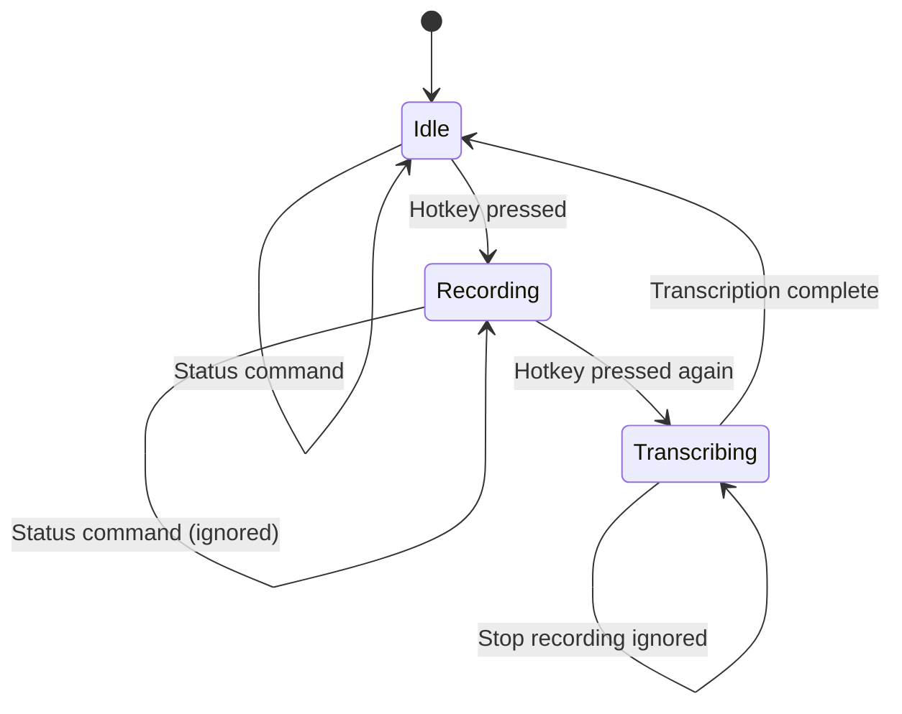

# Chapter 18: IPC and Daemon Mode

When `whis listen` runs, it becomes a background daemon listening for hotkeys. But how do you stop it? How do you check its status? This chapter explores inter-process communication (IPC) using Unix domain sockets and Windows named pipes, allowing `whis stop` and `whis status` to communicate with the running daemon.

## The Problem

The daemon runs in one terminal:
```bash
Terminal 1: $ whis listen
🎧 Listening for hotkey: ctrl+shift+r
```

You want to control it from another terminal:
```bash
Terminal 2: $ whis stop
✅ Service stopped.
```

**Challenge**: Two separate processes need to communicate.

## IPC Methods

Whis uses the `interprocess` crate which provides:

| Platform | Method | Path |
|----------|--------|------|
| **Linux/macOS** | Unix domain socket | `/tmp/whis.sock` or `$XDG_RUNTIME_DIR/whis.sock` |
| **Windows** | Named pipe | `\\.\pipe\whis` |

Both provide:
- Bidirectional communication
- Message passing (not shared memory)
- Process isolation (secure)

## Message Protocol

Whis uses JSON over the socket/pipe:

### Message Types

```rust
#[derive(Debug, Serialize, Deserialize)]
pub enum IpcMessage {
    Stop,
    Status,
}

#[derive(Debug, Serialize, Deserialize)]
pub enum IpcResponse {
    Success,
    Recording,
    Idle,
    Transcribing,
    Error(String),
}
```

**From `whis-cli/src/ipc.rs:9-22`**

**Wire format**:
```json
{"Stop"}              // Client → Server
{"Success"}           // Server → Client

{"Status"}            // Client → Server
{"Recording"}         // Server → Client
```

Serde handles serialization automatically.

## Socket Naming

### Unix (Linux/macOS)

```rust
#[cfg(unix)]
fn socket_name() -> String {
    std::env::var("XDG_RUNTIME_DIR")
        .map(|dir| format!("{dir}/whis.sock"))
        .unwrap_or_else(|_| "/tmp/whis.sock".to_string())
}
```

**From `whis-cli/src/ipc.rs:26-30`**

**Priority**:
1. `$XDG_RUNTIME_DIR/whis.sock` (user-specific, secure)
2. `/tmp/whis.sock` (fallback)

**`$XDG_RUNTIME_DIR`** (typically `/run/user/1000`):
- User-specific directory
- Cleaned up on logout
- Proper permissions (only owner can access)

### Windows

```rust
#[cfg(windows)]
fn socket_name() -> String {
    "whis".to_string()
}
```

**From `whis-cli/src/ipc.rs:33-35`**

Windows named pipes use format: `\\.\pipe\whis`

The `interprocess` crate adds the prefix automatically.

## PID File

To detect stale sockets, Whis also writes a PID (Process ID) file:

```rust
pub fn pid_file_path() -> PathBuf {
    #[cfg(unix)]
    {
        let runtime_dir = std::env::var("XDG_RUNTIME_DIR")
            .unwrap_or_else(|_| "/tmp".to_string());
        PathBuf::from(runtime_dir).join("whis.pid")
    }
    #[cfg(windows)]
    {
        let local_app_data = std::env::var("LOCALAPPDATA")
            .unwrap_or_else(|_| ".".to_string());
        PathBuf::from(local_app_data).join("whis").join("whis.pid")
    }
}
```

**From `whis-cli/src/ipc.rs:38-49`**

**PID file contents**:
```
12345
```

Just the process ID as a string.

**Why?**  
If the service crashes, the socket file might remain. The PID file lets us detect whether the process is actually running.

## IPC Server (Daemon Side)

### Creating the Server

```rust
pub struct IpcServer {
    listener: LocalSocketListener,
    #[cfg(unix)]
    socket_path: PathBuf,
}

impl IpcServer {
    pub fn new() -> Result<Self> {
        let name_str = socket_name();

        // On Unix, remove old socket if it exists
        #[cfg(unix)]
        let socket_path = PathBuf::from(&name_str);
        #[cfg(unix)]
        if socket_path.exists() {
            std::fs::remove_file(&socket_path)
                .context("Failed to remove old socket file")?;
        }

        let name = name_str
            .to_fs_name::<GenericFilePath>()
            .context("Failed to create socket name")?;

        let listener = ListenerOptions::new()
            .name(name)
            .create_sync()
            .context("Failed to create IPC listener")?;

        // Set non-blocking mode
        listener
            .set_nonblocking(ListenerNonblockingMode::Both)
            .context("Failed to set non-blocking mode")?;

        Ok(Self {
            listener,
            #[cfg(unix)]
            socket_path,
        })
    }
}
```

**From `whis-cli/src/ipc.rs:52-89`**

**Steps**:

1. **Remove old socket**: If daemon crashed, socket file might remain
2. **Create listener**: Bind to socket/pipe
3. **Set non-blocking**: Don't block main loop waiting for connections

### Non-Blocking Accept

```rust
pub fn try_accept(&self) -> Result<Option<IpcConnection>> {
    match self.listener.accept() {
        Ok(stream) => Ok(Some(IpcConnection { stream })),
        Err(e) if e.kind() == std::io::ErrorKind::WouldBlock => Ok(None),
        Err(e) => Err(e.into()),
    }
}
```

**From `whis-cli/src/ipc.rs:92-98`**

**Returns**:
- `Ok(Some(conn))`: New connection
- `Ok(None)`: No pending connections (would block)
- `Err(e)`: Actual error

**Used in main loop**:
```rust
loop {
    if let Some(mut conn) = ipc_server.try_accept()? {
        // Handle connection
    }
    // Check for hotkey press
    // Sleep briefly
}
```

Non-blocking means we can handle both IPC and hotkeys in one loop.

### Cleanup on Drop

```rust
impl Drop for IpcServer {
    fn drop(&mut self) {
        #[cfg(unix)]
        {
            let _ = std::fs::remove_file(&self.socket_path);
        }
        // Windows named pipes are cleaned up automatically
    }
}
```

**From `whis-cli/src/ipc.rs:101-110`**

**RAII pattern**: When server drops, socket file is deleted.

## IPC Connection

Once a client connects, we get an `IpcConnection`:

```rust
pub struct IpcConnection {
    stream: LocalSocketStream,
}

impl IpcConnection {
    pub fn receive(&mut self) -> Result<IpcMessage> {
        let mut reader = BufReader::new(&mut self.stream);
        let mut line = String::new();
        reader
            .read_line(&mut line)
            .context("Failed to read from socket")?;

        serde_json::from_str(line.trim())
            .context("Failed to deserialize message")
    }

    pub fn send(&mut self, response: IpcResponse) -> Result<()> {
        let json = serde_json::to_string(&response)?;
        writeln!(self.stream, "{json}")
            .context("Failed to write to socket")?;
        self.stream.flush()
            .context("Failed to flush socket")?;
        Ok(())
    }
}
```

**From `whis-cli/src/ipc.rs:113-136`**

**Protocol**:
- Each message is one line
- JSON serialized
- Newline-terminated (`\n`)

**Example exchange**:
```
Client writes: {"Stop"}\n
Server writes: {"Success"}\n
```

## IPC Client (Command Side)

### Connecting

```rust
pub struct IpcClient {
    stream: LocalSocketStream,
}

impl IpcClient {
    pub fn connect() -> Result<Self> {
        let name_str = socket_name();

        // On Unix, check if socket exists first
        #[cfg(unix)]
        {
            let path = PathBuf::from(&name_str);
            if !path.exists() {
                anyhow::bail!(
                    "whis service is not running.\n\
                    Start it with: whis listen"
                );
            }
        }

        let name = name_str
            .to_fs_name::<GenericFilePath>()
            .context("Failed to create socket name")?;

        let stream = LocalSocketStream::connect(name)
            .with_context(|| {
                #[cfg(unix)]
                {
                    "Failed to connect to whis service.\n\
                    The service may have crashed. Try removing stale files:\n\
                      rm -f $XDG_RUNTIME_DIR/whis.*\n\
                    Then start the service again with: whis listen"
                }
                #[cfg(windows)]
                {
                    "Failed to connect to whis service.\n\
                    The service may not be running. Start it with: whis listen"
                }
            })?;

        Ok(Self { stream })
    }
}
```

**From `whis-cli/src/ipc.rs:143-179`**

**Helpful errors**:
- Socket doesn't exist: "service is not running"
- Can't connect: "service may have crashed" (with cleanup instructions)

### Sending Messages

```rust
pub fn send_message(&mut self, message: IpcMessage) -> Result<IpcResponse> {
    // Send message
    let json = serde_json::to_string(&message)?;
    writeln!(self.stream, "{json}")
        .context("Failed to send message")?;
    self.stream.flush()
        .context("Failed to flush stream")?;

    // Receive response
    let mut reader = BufReader::new(&mut self.stream);
    let mut line = String::new();
    reader
        .read_line(&mut line)
        .context("Failed to read response")?;

    serde_json::from_str(line.trim())
        .context("Failed to deserialize response")
}
```

**From `whis-cli/src/ipc.rs:181-195`**

**Request-response pattern**:
1. Serialize message to JSON
2. Write line to socket
3. Flush (ensure sent)
4. Read response line
5. Deserialize response

## Checking Service Status

Before trying to connect, check if the service is running:

```rust
pub fn is_service_running() -> bool {
    let name_str = socket_name();

    #[cfg(unix)]
    let socket_path = PathBuf::from(&name_str);

    #[cfg(unix)]
    if !socket_path.exists() {
        return false;
    }

    // Try to connect to check if service is actually running
    let name = match name_str.to_fs_name::<GenericFilePath>() {
        Ok(n) => n,
        Err(_) => return false,
    };

    match LocalSocketStream::connect(name) {
        Ok(_) => true, // Successfully connected
        Err(_) => {
            // Can't connect - clean up stale files
            #[cfg(unix)]
            {
                let _ = std::fs::remove_file(&socket_path);
            }
            remove_pid_file();
            false
        }
    }
}
```

**From `whis-cli/src/ipc.rs:199-233`**

**Two checks**:
1. Socket file exists? (Unix only, quick check)
2. Can connect? (actual liveness test)

**Cleanup**: If socket exists but connection fails, remove stale files.

## PID File Management

### Writing PID

```rust
pub fn write_pid_file() -> Result<()> {
    let path = pid_file_path();

    // Ensure parent directory exists (Windows)
    if let Some(parent) = path.parent() {
        std::fs::create_dir_all(parent).ok();
    }

    let pid = std::process::id();
    std::fs::write(&path, pid.to_string())
        .context("Failed to write PID file")?;
    Ok(())
}
```

**From `whis-cli/src/ipc.rs:236-247`**

Called when daemon starts:
```rust
pub fn run_daemon() -> Result<()> {
    write_pid_file()?;
    // ... start service
}
```

### Removing PID

```rust
pub fn remove_pid_file() {
    let path = pid_file_path();
    let _ = std::fs::remove_file(path);
}
```

**From `whis-cli/src/ipc.rs:250-253`**

Called on normal shutdown or when detecting stale socket.

## The Service Main Loop

The daemon handles both IPC and hotkeys:

```rust
pub async fn run(&self, hotkey_rx: Option<Receiver<()>>) -> Result<()> {
    let ipc_server = IpcServer::new()
        .context("Failed to create IPC server")?;

    println!("whis listening. Ctrl+C to stop.");

    loop {
        // Check for IPC connections (non-blocking)
        if let Some(mut conn) = ipc_server.try_accept()? {
            match conn.receive() {
                Ok(message) => {
                    let response = self.handle_message(message).await;
                    let _ = conn.send(response);
                }
                Err(e) => {
                    eprintln!("Error receiving message: {e}");
                    let _ = conn.send(IpcResponse::Error(e.to_string()));
                }
            }
        }

        // Check for hotkey toggle (non-blocking)
        if let Some(ref rx) = hotkey_rx
            && rx.try_recv().is_ok()
        {
            self.handle_toggle().await;
        }

        // Small sleep to prevent busy waiting
        sleep(Duration::from_millis(10)).await;
    }
}
```

**From `whis-cli/src/service.rs:44-75`**

**Main loop**:
1. Check for new IPC connections
2. Check for hotkey presses
3. Sleep 10ms (prevent CPU spinning)
4. Repeat

Both checks are **non-blocking** so the loop never stalls.

## Handling IPC Messages

```rust
async fn handle_message(&self, message: IpcMessage) -> IpcResponse {
    match message {
        IpcMessage::Stop => {
            println!("Stop signal received");
            // Return response before exiting
            tokio::spawn(async {
                tokio::time::sleep(tokio::time::Duration::from_millis(100)).await;
                std::process::exit(0);
            });
            IpcResponse::Success
        }
        IpcMessage::Status => {
            let state = *self.state.lock().unwrap();
            match state {
                ServiceState::Idle => IpcResponse::Idle,
                ServiceState::Recording => IpcResponse::Recording,
                ServiceState::Transcribing => IpcResponse::Transcribing,
            }
        }
    }
}
```

**From `whis-cli/src/service.rs:78-98`**

### Stop Command

**Problem**: If we call `exit(0)` immediately, the response might not be sent.

**Solution**: Spawn task that exits after 100ms, giving time to send response.

```rust
tokio::spawn(async {
    tokio::time::sleep(Duration::from_millis(100)).await;
    std::process::exit(0);
});
IpcResponse::Success // Send this first
```

### Status Command

Read current state (Idle, Recording, Transcribing) and return it.

**State tracking**:
```rust
#[derive(Debug, Clone, Copy, PartialEq)]
enum ServiceState {
    Idle,
    Recording,
    Transcribing,
}
```

**From `whis-cli/src/service.rs:15-20`**

Protected by mutex since accessed from both main loop and async tasks.

## Command Implementations

### `whis stop`

```rust
pub fn run() -> Result<()> {
    if !is_service_running() {
        println!("whis service is not running.");
        return Ok(());
    }

    let mut client = IpcClient::connect()?;
    let response = client.send_message(IpcMessage::Stop)?;

    match response {
        IpcResponse::Success => {
            println!("✅ Service stopped.");
            Ok(())
        }
        IpcResponse::Error(e) => {
            anyhow::bail!("Failed to stop service: {e}");
        }
        _ => {
            anyhow::bail!("Unexpected response: {response:?}");
        }
    }
}
```

**Simplified from `whis-cli/src/commands/stop.rs`**

**Flow**:
1. Check if service is running
2. Connect to IPC socket
3. Send `Stop` message
4. Wait for `Success` response
5. Print confirmation

### `whis status`

```rust
pub fn run() -> Result<()> {
    if !is_service_running() {
        println!("❌ Service: Not running");
        println!("\nStart with: whis listen");
        return Ok(());
    }

    let mut client = IpcClient::connect()?;
    let response = client.send_message(IpcMessage::Status)?;

    match response {
        IpcResponse::Idle => {
            println!("✅ Service: Running (Idle)");
            println!("Press hotkey to start recording.");
        }
        IpcResponse::Recording => {
            println!("🎤 Service: Running (Recording)");
            println!("Press hotkey again to stop.");
        }
        IpcResponse::Transcribing => {
            println!("🔄 Service: Running (Transcribing)");
            println!("Please wait...");
        }
        IpcResponse::Error(e) => {
            println!("❌ Service error: {e}");
        }
        _ => {
            println!("❓ Unexpected response: {response:?}");
        }
    }

    Ok(())
}
```

**Simplified from `whis-cli/src/commands/status.rs`**

**Flow**:
1. Check if service is running (quick check)
2. If running, connect and send `Status` message
3. Display state with appropriate emoji and instructions

## State Machine

The service tracks state to handle hotkey toggles:



**State transitions**:

| Current State | Event | New State | Action |
|---------------|-------|-----------|--------|
| Idle | Hotkey | Recording | Start recording |
| Recording | Hotkey | Transcribing | Stop recording, transcribe |
| Transcribing | Hotkey | Transcribing | Ignored (wait for completion) |
| Any | Stop IPC | - | Exit process |
| Any | Status IPC | Same | Return current state |

## Real-World Usage

### Starting the Daemon

```bash
$ whis listen
🎧 Listening for hotkey: ctrl+shift+r
whis listening. Ctrl+C to stop.

# Press Ctrl+Shift+R
#1 recording...

# Press Ctrl+Shift+R again
#1 transcribing...
#1 done

# Press Ctrl+Shift+R
#2 recording...
```

### Checking Status

```bash
$ whis status
✅ Service: Running (Idle)
Press hotkey to start recording.
```

During recording:
```bash
$ whis status
🎤 Service: Running (Recording)
Press hotkey again to stop.
```

### Stopping the Daemon

```bash
$ whis stop
✅ Service stopped.
```

Back in the first terminal:
```
Stop signal received
[Process exits]
```

## Error Scenarios

### Service Not Running

```bash
$ whis stop
whis service is not running.

$ whis status
❌ Service: Not running

Start with: whis listen
```

### Stale Socket File

```bash
$ whis listen
Error: Failed to create IPC listener
Caused by: Address already in use

# Daemon crashed, socket file remains
$ ls $XDG_RUNTIME_DIR/whis.sock
/run/user/1000/whis.sock

# Clean up manually
$ rm $XDG_RUNTIME_DIR/whis.*
$ whis listen
🎧 Listening for hotkey: ctrl+shift+r
```

Or use the helper:
```bash
$ whis status  # Detects stale socket, cleans up
❌ Service: Not running
```

### Multiple Daemon Attempts

```bash
Terminal 1: $ whis listen
🎧 Listening...

Terminal 2: $ whis listen
Error: Failed to create IPC listener
Caused by: Address already in use

Another instance is already running.
```

Only one daemon can bind to the socket at a time.

## Summary

**Key Takeaways:**

1. **IPC mechanism**: Unix domain sockets (Linux/macOS) and named pipes (Windows)
2. **Message protocol**: JSON-serialized enums over newline-delimited text
3. **Non-blocking**: Server uses `try_accept()` to avoid blocking main loop
4. **PID file**: Detects stale sockets from crashed daemons
5. **State machine**: Idle → Recording → Transcribing → Idle
6. **RAII cleanup**: Socket file removed on `Drop`

**Where This Matters in Whis:**

- CLI daemon mode (`whis-cli/src/commands/listen.rs`)
- Stop command (`whis-cli/src/commands/stop.rs`)
- Status command (`whis-cli/src/commands/status.rs`)
- Service main loop (`whis-cli/src/service.rs`)

**Patterns Used:**

- **Non-blocking I/O**: Interleave IPC and hotkey handling
- **Request-response**: Client sends message, waits for response
- **RAII**: Automatic socket cleanup
- **State machine**: Track service state for toggle behavior

**Design Decisions:**

1. **Why JSON?** Human-readable, serde integration, debugging-friendly
2. **Why newline-delimited?** Simple framing, easy buffering
3. **Why non-blocking?** Single-threaded main loop, no deadlocks
4. **Why PID file?** Detect crashed daemons, clean up stale sockets

---

**Part V Complete!**

You now understand the Whis CLI:
- Clap for argument parsing and subcommands
- Cross-platform hotkey registration (rdev, global-hotkey)
- IPC for daemon control (Unix sockets, named pipes)

---

Next: [Part VI: The Tauri Desktop App](../part6-tauri/README.md)

Part VI covers the desktop GUI built with Tauri: architecture, state management, commands, and platform-specific shortcuts.
