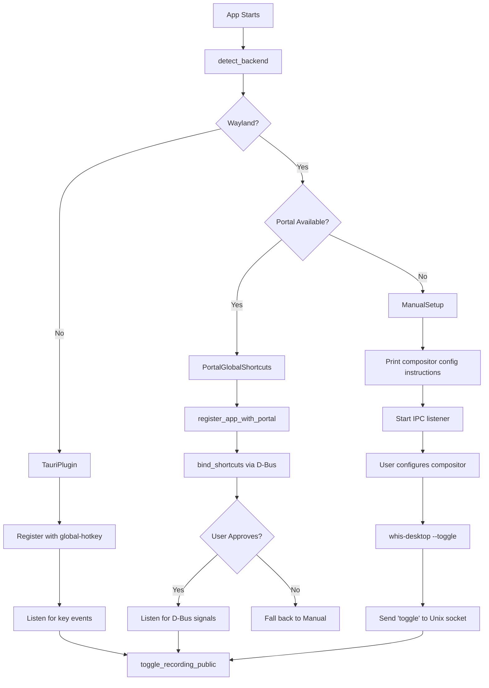

# Chapter 22: Global Shortcuts (Desktop)

One of Whis's core features is a global keyboard shortcut—press a key combo anywhere on your system, and recording starts. Simple in concept, but implementing it across different Linux display servers (X11 vs Wayland) requires a three-pronged approach.

In this chapter, we'll explore:
- Why global shortcuts are harder on Wayland than X11
- How Whis detects and selects the right backend (TauriPlugin/Portal/Manual)
- The XDG Desktop Portal GlobalShortcuts API
- The fallback IPC mechanism for manual compositor configuration

## The Problem: Wayland's Security Model

On X11, any application can register a global shortcut using libraries like `global-hotkey` or `rdev`. The X server grants direct access to keyboard input.

Wayland takes a security-first approach: applications **cannot** listen to keyboard events outside their windows. This prevents keylogging but also breaks traditional global shortcut mechanisms.

The solution: **XDG Desktop Portal**, specifically the `GlobalShortcuts` interface introduced in portal version 1 (2023). The compositor mediates shortcut registration, and the user must explicitly approve bindings.

But not all compositors support it yet:
- **GNOME 48+**: Full support with nice configuration UI
- **KDE Plasma 6+**: Portal support
- **Hyprland**: Portal support (experimental)
- **Sway/wlroots compositors**: No portal support (as of 2025)

For environments without portal support, Whis falls back to **manual setup**: the user configures their compositor to run `whis-desktop --toggle`, which sends a message via Unix socket to the running instance.

## Three Shortcut Backends

Whis defines three backends in `whis-desktop/src/shortcuts.rs:8-16`:

```rust
#[derive(Debug, Clone, Copy, PartialEq)]
pub enum ShortcutBackend {
    /// Tauri plugin - works on X11, macOS, Windows
    TauriPlugin,
    /// XDG Portal GlobalShortcuts - works on Wayland with GNOME 48+, KDE, Hyprland
    PortalGlobalShortcuts,
    /// Manual setup - user configures compositor to run `whis-desktop --toggle`
    ManualSetup,
}
```

**From `whis-desktop/src/shortcuts.rs:8-16`**

- **TauriPlugin**: Uses `tauri-plugin-global-shortcut`, wraps `global-hotkey` crate. Works on X11, macOS, Windows. Fast, synchronous.
- **PortalGlobalShortcuts**: Uses `ashpd` crate to communicate with `org.freedesktop.portal.Desktop` D-Bus service. Async, requires user approval.
- **ManualSetup**: No automatic registration. User binds a key in their compositor config to run `whis-desktop --toggle`.

## Backend Detection

At app startup, `detect_backend()` (line 72) inspects the environment:

```rust
pub fn detect_backend() -> ShortcutCapability {
    let session_type = env::var("XDG_SESSION_TYPE").unwrap_or_default();
    let wayland_display = env::var("WAYLAND_DISPLAY").is_ok();

    // Check if running on Wayland
    if session_type == "wayland" || wayland_display {
        if is_portal_available() {
            ShortcutCapability {
                backend: ShortcutBackend::PortalGlobalShortcuts,
                compositor: detect_compositor(),
            }
        } else {
            ShortcutCapability {
                backend: ShortcutBackend::ManualSetup,
                compositor: detect_compositor(),
            }
        }
    } else {
        // X11 or other - use Tauri plugin
        ShortcutCapability {
            backend: ShortcutBackend::TauriPlugin,
            compositor: "X11".into(),
        }
    }
}
```

**From `whis-desktop/src/shortcuts.rs:72-96`**

The logic:
1. Check `XDG_SESSION_TYPE` environment variable (set by display managers)
2. If Wayland, check if portal is available via D-Bus introspection
3. If portal exists → `PortalGlobalShortcuts`
4. If no portal → `ManualSetup`
5. If not Wayland (X11, etc.) → `TauriPlugin`

Portal availability check (line 99):

```rust
fn is_portal_available() -> bool {
    std::process::Command::new("busctl")
        .args([
            "--user",
            "introspect",
            "org.freedesktop.portal.Desktop",
            "/org/freedesktop/portal/desktop",
        ])
        .output()
        .map(|o| String::from_utf8_lossy(&o.stdout).contains("GlobalShortcuts"))
        .unwrap_or(false)
}
```

**From `whis-desktop/src/shortcuts.rs:99-110`**

This spawns `busctl` (systemd's D-Bus tool) to check if the `GlobalShortcuts` interface exists on the portal service.

## Path 1: TauriPlugin (X11)

Simplest case. `setup_tauri_shortcut()` (line 449) registers the shortcut synchronously:

```rust
pub fn setup_tauri_shortcut(app: &tauri::App, shortcut_str: &str) 
    -> Result<(), Box<dyn std::error::Error>> 
{
    let app_handle = app.handle().clone();
    
    let shortcut = Shortcut::from_str(shortcut_str)
        .map_err(|e| format!("Invalid shortcut: {e}"))?;

    app.handle().plugin(
        tauri_plugin_global_shortcut::Builder::new()
            .with_handler(move |_app, _shortcut, event| {
                if event.state() == ShortcutState::Pressed {
                    println!("Tauri shortcut triggered!");
                    let handle = app_handle.clone();
                    tauri::async_runtime::spawn(async move {
                        crate::tray::toggle_recording_public(handle);
                    });
                }
            })
            .build(),
    )?;

    app.global_shortcut().register(shortcut)?;
    println!("Tauri global shortcut registered: {shortcut_str}");
    Ok(())
}
```

**From `whis-desktop/src/shortcuts.rs:449-475`**

- Parse shortcut string (e.g., `"Ctrl+Shift+R"`) into `Shortcut` struct
- Register plugin with handler that spawns async task to call `toggle_recording_public()`
- Register shortcut with X11 backend
- If it fails, fall back to `ManualSetup`

**Key advantage**: No user interaction required, works immediately.

## Path 2: PortalGlobalShortcuts (Wayland)

Much more complex. Let's break down the flow.

### App ID Registration

Portal needs to identify which app is requesting shortcuts. On Wayland, the compositor typically determines this from the window's app_id. But for native (non-Flatpak) apps launched from terminal, the compositor can't reliably detect the app_id.

Solution: Explicitly register with the portal's `Registry` interface (line 119):

```rust
pub async fn register_app_with_portal() 
    -> Result<(), Box<dyn std::error::Error + Send + Sync>> 
{
    use std::collections::HashMap;
    use zbus::Connection;

    println!("Registering app_id 'ink.whis.Whis' with portal...");

    let connection = Connection::session().await?;

    let result: Result<(), zbus::Error> = connection
        .call_method(
            Some("org.freedesktop.portal.Desktop"),
            "/org/freedesktop/portal/desktop",
            Some("org.freedesktop.host.portal.Registry"),
            "Register",
            &("ink.whis.Whis", HashMap::<String, zbus::zvariant::Value>::new()),
        )
        .await
        .map(|_: zbus::Message| ());

    match result {
        Ok(_) => {
            println!("Successfully registered app_id with portal");
            Ok(())
        }
        Err(e) => {
            println!("Portal Registry registration failed (may be unavailable): {e}");
            Ok(())
        }
    }
}
```

**From `whis-desktop/src/shortcuts.rs:119-154`**

The app_id `"ink.whis.Whis"` **must match** the `.desktop` file name (`ink.whis.Whis.desktop`). This is set very early in `main.rs:6-13`:

```rust
#[cfg(target_os = "linux")]
{
    gtk::glib::set_prgname(Some("ink.whis.Whis"));
    gtk::glib::set_application_name("Whis");
}
```

**From `whis-desktop/src/main.rs:6-13`**

This must happen **before** GTK initialization, because GTK reads these values to set the Wayland app_id.

### Binding Shortcuts

`setup_portal_shortcuts()` (line 203) does the heavy lifting:

```rust
pub async fn setup_portal_shortcuts<F>(
    shortcut_str: String,
    on_toggle: F,
    app_handle: AppHandle,
) -> Result<(), Box<dyn std::error::Error>>
where
    F: Fn() + Send + Sync + 'static,
{
    use ashpd::desktop::global_shortcuts::{GlobalShortcuts, NewShortcut};
    use futures_util::StreamExt;

    // Register app_id first
    if let Err(e) = register_app_with_portal().await {
        eprintln!("Warning: Portal registration failed: {e}");
    }

    // Check for existing shortcut in dconf (GNOME stores approved shortcuts here)
    if let Some(existing) = read_portal_shortcut_from_dconf() {
        println!("Found existing portal shortcut in dconf: {existing}");
        let state = app_handle.state::<crate::state::AppState>();
        *state.portal_shortcut.lock().unwrap() = Some(existing);
    }

    let shortcuts = GlobalShortcuts::new().await?;
    let session = shortcuts.create_session().await?;

    // Define the shortcut
    let shortcut = NewShortcut::new("toggle-recording", "Toggle voice recording")
        .preferred_trigger(Some(shortcut_str.as_str()));

    // Try to bind (GNOME shows dialog)
    match shortcuts.bind_shortcuts(&session, &[shortcut], None).await {
        Ok(request) => {
            match request.response() {
                Ok(bind_response) => {
                    if let Some(bound) = bind_response
                        .shortcuts()
                        .iter()
                        .find(|s| s.id() == "toggle-recording")
                    {
                        let trigger = bound.trigger_description().to_string();
                        if !trigger.is_empty() {
                            println!("Portal bound shortcut: {trigger}");
                            let state = app_handle.state::<crate::state::AppState>();
                            *state.portal_shortcut.lock().unwrap() = Some(trigger);
                        }
                    }
                }
                Err(e) => {
                    eprintln!("Portal bind failed: {e}");
                }
            }
        }
        Err(e) => {
            eprintln!("Portal request failed: {e}");
        }
    }

    // Listen for activations
    let mut activated = shortcuts.receive_activated().await?;
    while let Some(event) = activated.next().await {
        if event.shortcut_id() == "toggle-recording" {
            println!("Portal shortcut triggered!");
            on_toggle();
        }
    }

    Ok(())
}
```

**From `whis-desktop/src/shortcuts.rs:203-304` (simplified)**

Key steps:

1. **Register app_id** with portal
2. **Check dconf** for existing approved shortcut (GNOME stores them in `~/.config/dconf`)
3. **Create portal session** (required for all portal interactions)
4. **Bind shortcut** with `bind_shortcuts()`:
   - Provide shortcut ID (`"toggle-recording"`)
   - Provide description (shown to user)
   - Provide preferred trigger (`"Ctrl+Shift+R"`)
   - GNOME shows a system dialog asking user to approve
5. **Store actual binding** in `AppState.portal_shortcut` (compositor may modify it to avoid conflicts)
6. **Listen for activations** with `receive_activated()` (async stream)

The activation listener runs **forever** in a spawned task. When the user presses the shortcut, the compositor sends a D-Bus signal, `ashpd` receives it, and the callback fires.

### Reading from dconf

Why check dconf? Because if the user already approved the shortcut in a previous session, it's stored in GNOME's settings database. We can read it without triggering the approval dialog again.

```rust
pub fn read_portal_shortcut_from_dconf() -> Option<String> {
    let output = std::process::Command::new("dconf")
        .args(["dump", "/org/gnome/settings-daemon/global-shortcuts/"])
        .output()
        .ok()?;

    let dump = String::from_utf8_lossy(&output.stdout);

    for line in dump.lines() {
        if line.contains("toggle-recording") && line.contains("shortcuts") {
            if let Some(start) = line.find("<['")
                && let Some(end) = line[start..].find("']>")
            {
                let raw = &line[start + 3..start + end];
                return Some(convert_gvariant_shortcut(raw));
            }
        }
    }
    None
}
```

**From `whis-desktop/src/shortcuts.rs:158-182`**

GNOME stores shortcuts in GVariant format: `<Control><Alt>m`. We convert this to human-readable format: `Ctrl+Alt+M`.

### Portal Version Differences

Portal v1 and v2 have different APIs:
- **Portal v1**: `bind_shortcuts()` only. User must open GNOME Settings manually to configure.
- **Portal v2**: Adds `configure_shortcuts()` method that opens system settings programmatically.

Whis checks the version (line 34) using `busctl get-property`:

```rust
pub fn portal_version() -> u32 {
    std::process::Command::new("busctl")
        .args([
            "--user",
            "get-property",
            "org.freedesktop.portal.Desktop",
            "/org/freedesktop/portal/desktop",
            "org.freedesktop.portal.GlobalShortcuts",
            "version",
        ])
        .output()
        .ok()
        .and_then(|o| {
            let output = String::from_utf8_lossy(&o.stdout);
            output.split_whitespace().last()?.parse().ok()
        })
        .unwrap_or(0)
}
```

**From `whis-desktop/src/shortcuts.rs:34-52`**

If v2 is available, `bind_shortcut_with_trigger()` (line 317) also calls `configure_shortcuts()` to open the settings dialog automatically.

## Path 3: ManualSetup (No Portal)

If portal is unavailable (Sway, older KDE, etc.), Whis prints instructions to stdout:

```rust
fn print_manual_setup_instructions(compositor: &str, shortcut: &str) {
    println!();
    println!("=== Global Shortcuts Not Available ===");
    println!("Compositor: {compositor}");
    println!();
    println!("To use a keyboard shortcut, configure your compositor:");
    println!();
    match compositor.to_lowercase().as_str() {
        s if s.contains("sway") => {
            println!("Sway: Add to ~/.config/sway/config:");
            println!("  bindsym {} exec whis-desktop --toggle", shortcut.to_lowercase());
        }
        s if s.contains("hyprland") => {
            println!("Hyprland: Add to ~/.config/hypr/hyprland.conf:");
            println!("  bind = {}, exec, whis-desktop --toggle", shortcut.replace("+", ", "));
        }
        _ => {
            println!("Configure your compositor to run: whis-desktop --toggle");
        }
    }
    println!();
}
```

**From `whis-desktop/src/shortcuts.rs:550-581`**

The user adds a binding in their compositor config (e.g., Sway's `bindsym Ctrl+Shift+r exec whis-desktop --toggle`). When pressed, it runs `whis-desktop` with the `--toggle` flag.

## IPC: The --toggle Flag

When `whis-desktop --toggle` runs, `main.rs` (line 19) detects the flag and calls `send_toggle_command()` instead of starting the GUI:

```rust
if args.contains(&"--toggle".to_string()) {
    if let Err(e) = whis_desktop::shortcuts::send_toggle_command() {
        eprintln!("Failed to toggle: {e}");
        std::process::exit(1);
    }
    return;
}
```

**From `whis-desktop/src/main.rs:19-25`**

`send_toggle_command()` (line 584) connects to a Unix socket and sends `"toggle"`:

```rust
pub fn send_toggle_command() -> Result<(), Box<dyn std::error::Error>> {
    use std::io::Write;
    use std::os::unix::net::UnixStream;

    let socket_path = socket_path();

    match UnixStream::connect(&socket_path) {
        Ok(mut stream) => {
            stream.write_all(b"toggle")?;
            println!("Toggle command sent");
            Ok(())
        }
        Err(e) => {
            eprintln!("Could not connect to running instance: {e}");
            eprintln!("Is whis-desktop running?");
            Err(e.into())
        }
    }
}
```

**From `whis-desktop/src/shortcuts.rs:584-602`**

The main instance runs an IPC listener (line 605):

```rust
pub fn start_ipc_listener(app_handle: AppHandle) {
    let socket_path = socket_path();
    let _ = std::fs::remove_file(&socket_path);

    std::thread::spawn(move || {
        use std::io::Read;
        use std::os::unix::net::UnixListener;

        let listener = match UnixListener::bind(&socket_path) {
            Ok(l) => l,
            Err(e) => {
                eprintln!("Failed to create IPC socket: {e}");
                return;
            }
        };

        println!("IPC listener started at {socket_path}");

        for stream in listener.incoming() {
            match stream {
                Ok(mut stream) => {
                    let mut buf = [0u8; 64];
                    if let Ok(n) = stream.read(&mut buf) {
                        let cmd = String::from_utf8_lossy(&buf[..n]);
                        if cmd.trim() == "toggle" {
                            println!("IPC: toggle command received");
                            let handle = app_handle.clone();
                            tauri::async_runtime::spawn(async move {
                                crate::tray::toggle_recording_public(handle);
                            });
                        }
                    }
                }
                Err(e) => eprintln!("IPC connection error: {e}"),
            }
        }
    });
}
```

**From `whis-desktop/src/shortcuts.rs:605-645`**

This is identical to the CLI IPC mechanism from Chapter 18. The listener runs in a background thread, reads messages, and dispatches to the Tauri async runtime to call `toggle_recording_public()`.

Socket path: `$XDG_RUNTIME_DIR/whis-desktop.sock` (typically `/run/user/1000/whis-desktop.sock`).

## Real-World Flow Diagram



## Frontend Integration

The frontend needs to know which backend is active and what shortcut is configured. Commands from `commands.rs` (line 59):

```rust
#[tauri::command]
pub fn shortcut_backend() -> ShortcutBackendInfo {
    crate::shortcuts::backend_info()
}

#[tauri::command]
pub async fn configure_shortcut(app: AppHandle) -> Result<Option<String>, String> {
    crate::shortcuts::open_configure_shortcuts(app)
        .await
        .map_err(|e| e.to_string())
}

#[tauri::command]
pub fn portal_shortcut(state: State<'_, AppState>) -> Result<Option<String>, String> {
    let cached = state.portal_shortcut.lock().unwrap().clone();
    if cached.is_some() {
        return Ok(cached);
    }
    Ok(crate::shortcuts::read_portal_shortcut_from_dconf())
}
```

**From `whis-desktop/src/commands.rs:59-92`**

- `shortcut_backend()`: Returns backend type, compositor name, portal version
- `configure_shortcut()`: Opens portal settings dialog (Portal v2+)
- `portal_shortcut()`: Returns currently active portal shortcut

The frontend can display:
- "Shortcut: Ctrl+Shift+R (via Portal)" on GNOME
- "Shortcut: Not configured. See instructions below." on Sway

## Dynamic Shortcut Updates

On X11 (TauriPlugin), shortcuts can be changed without restart:

```rust
pub fn update_shortcut(app: &AppHandle, new_shortcut: &str) 
    -> Result<bool, Box<dyn std::error::Error>> 
{
    let capability = detect_backend();

    match capability.backend {
        ShortcutBackend::TauriPlugin => {
            app.global_shortcut().unregister_all()?;
            let shortcut = Shortcut::from_str(new_shortcut)?;
            app.global_shortcut().register(shortcut)?;
            Ok(false) // No restart needed
        },
        _ => {
            Ok(true) // Restart needed
        }
    }
}
```

**From `whis-desktop/src/shortcuts.rs:527-547`**

For Portal/Manual, the app must restart to re-run the detection/binding flow. The function returns `true` to signal the frontend to show a "Restart required" message.

## Platform-Specific Gotchas

### GNOME
- Portal v1: User must manually open Settings → Keyboard → Custom Shortcuts after first launch
- Portal v2: App can open settings automatically
- Conflicts handled gracefully: Portal assigns different key if user's choice conflicts
- App ID **must** match `.desktop` file exactly

### KDE Plasma
- Portal support varies by version
- Older versions require manual configuration via System Settings
- KWin's GlobalShortcuts interface (D-Bus) is different from XDG portal

### Sway / wlroots
- No portal support (as of 2025)
- Manual config required: Add `bindsym` to `~/.config/sway/config`
- IPC works reliably

### Hyprland
- Portal support experimental
- Syntax: `bind = CTRL SHIFT, R, exec, whis-desktop --toggle`
- Fast IPC due to custom socket protocol

### X11
- Always works, no user approval needed
- Security concern: Any app can register global shortcuts

## Testing Shortcuts

To test backend detection:

```bash
# Check portal availability
busctl --user introspect org.freedesktop.portal.Desktop \
  /org/freedesktop/portal/desktop | grep GlobalShortcuts

# Check portal version
busctl --user get-property org.freedesktop.portal.Desktop \
  /org/freedesktop/portal/desktop \
  org.freedesktop.portal.GlobalShortcuts version

# Test IPC
whis-desktop --toggle
```

To test portal binding:

1. Launch Whis on GNOME Wayland
2. Check logs: `"Portal bound shortcut: Ctrl+Alt+M"`
3. Open GNOME Settings → Keyboard → View and Customize Shortcuts → Custom
4. Verify "Toggle voice recording (Whis)" appears
5. Press the bound key, check logs for `"Portal shortcut triggered!"`

## Summary

**Key Takeaways:**

1. **Three backends**: TauriPlugin (X11), PortalGlobalShortcuts (Wayland with portal), ManualSetup (fallback)
2. **Runtime detection**: Check `XDG_SESSION_TYPE` and D-Bus portal availability
3. **Portal requires app ID**: Must set via GTK before initialization, must match `.desktop` file
4. **User approval**: Portal binding triggers system dialog on first run
5. **IPC fallback**: Unix socket allows `whis-desktop --toggle` to communicate with running instance
6. **dconf caching**: GNOME stores approved shortcuts, can be read to avoid re-prompting user

**Where This Matters in Whis:**

- Settings page shows current backend and shortcut
- Different UX flows for X11 (instant) vs Wayland (approval dialog)
- Manual setup instructions displayed when portal unavailable

**Patterns Used:**

- **Strategy pattern**: `ShortcutBackend` enum with different implementations
- **Adapter pattern**: Convert between Tauri shortcut format and XDG format
- **IPC**: Unix sockets for inter-process communication

**Design Decisions:**

1. **Why three backends?** Wayland's security model requires portal, but not all compositors support it yet. X11 still widely used.
2. **Why dconf caching?** Avoid showing approval dialog every time app starts.
3. **Why IPC instead of single instance?** More flexible, allows scripting (`whis-desktop --toggle` in shell scripts).
4. **Why manual setup?** Portal will take years to reach all compositors. IPC provides immediate solution.

This completes Part VI: Tauri Desktop. Next, we'll explore the Vue 3.6 frontend and how it integrates with these Rust commands.

---

Next: [Chapter 23: Vue Frontend](../part7-frontend/ch23-vue.md)
